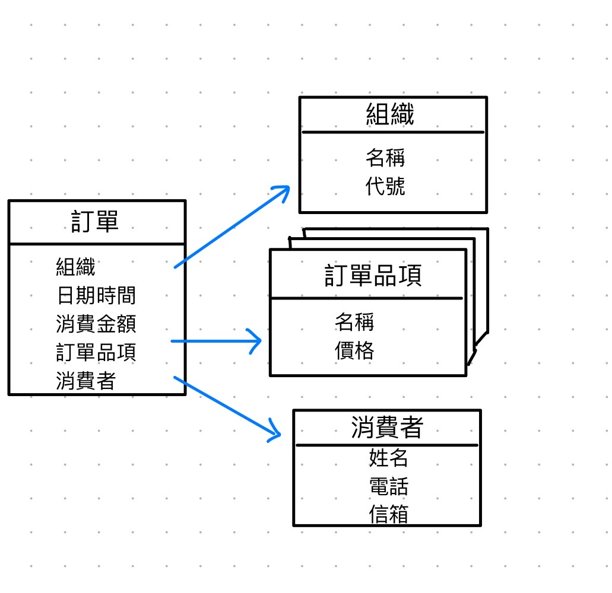
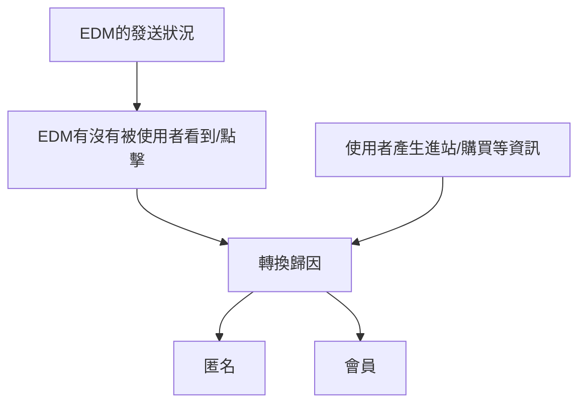
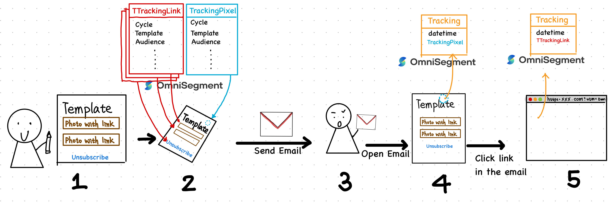
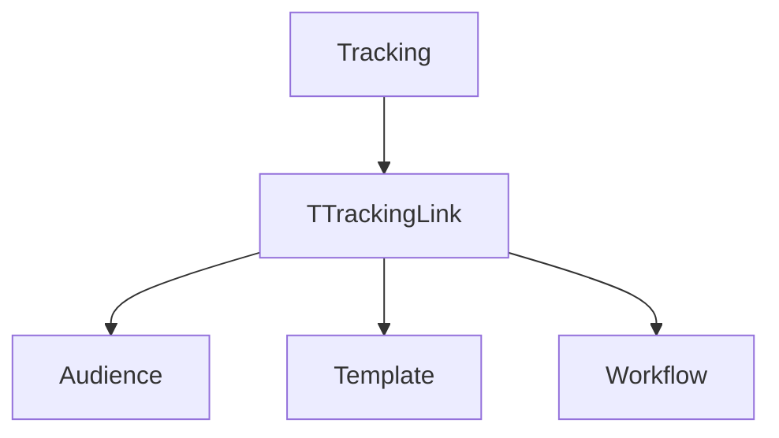
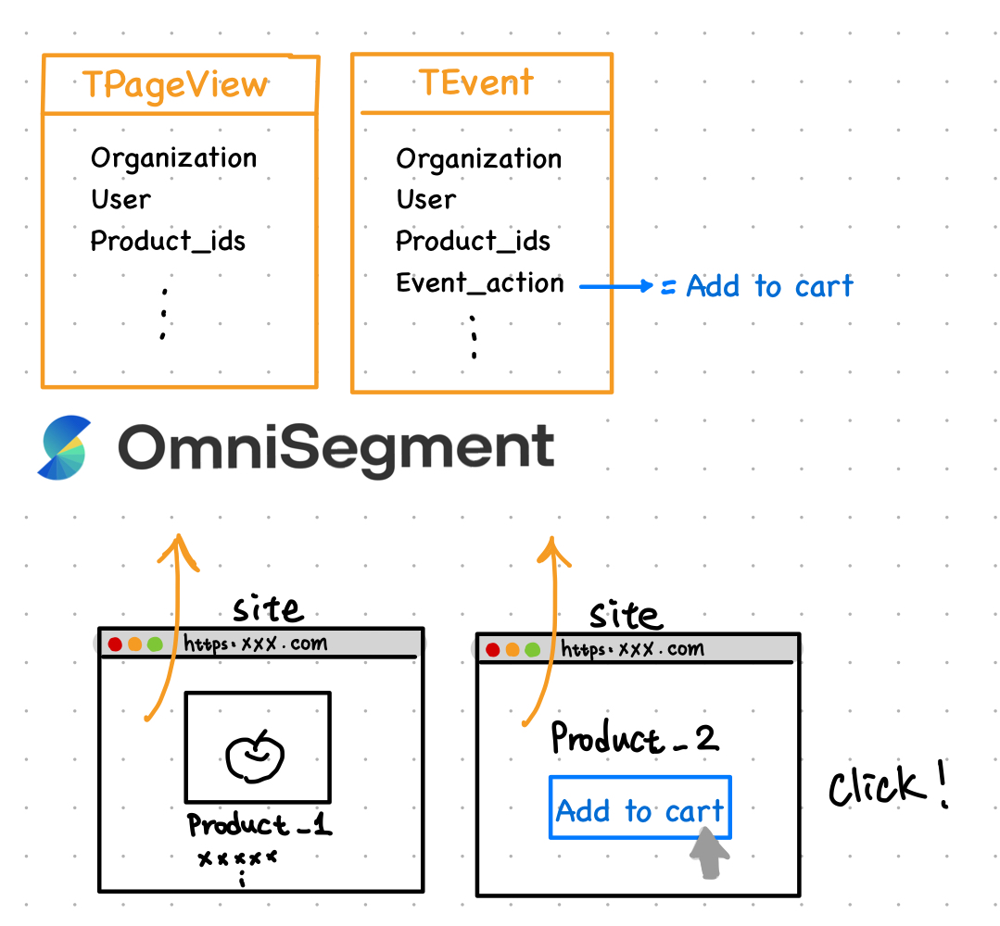
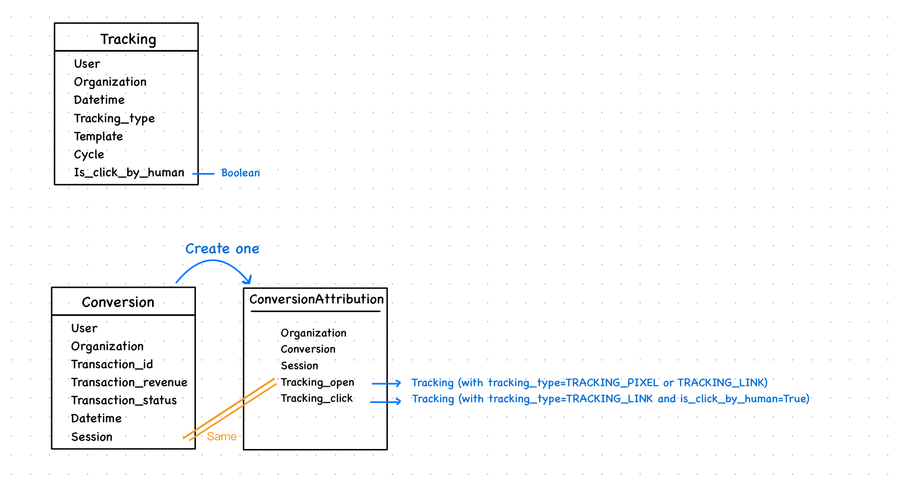

# 成效報表數據說明

顧客旅程成效內容為「渠道成效」＋「成本概況」的綜合～

（以下圖示為方便了解概念，可能簡化部分細節、流程，若要理解完整系統架構，請參考每個小節最下方的技術說明)

## 名詞、背景知識說明

**`Model`, `instance`,  `field`**

OS的資料庫會搜集各式各樣的資料，根據不同用途/型態分門別類，儲存在各個`Model`之中，多數時候彼此之間會有關聯性。

舉例來說：

訂單會存在`Model ` **訂單** 裡面，那訂單上紀錄的「日期時間」、「消費金額」、「消費者」、「訂單品項」等，稱作訂單這個model的`field`(欄位)，而每一筆訂單，我們會稱作一筆`instance`。

那所謂的關聯是什麼呢？訂單上紀錄了「消費者」，我們就可以憑這個資訊去另一個Model **消費者** 找到一筆instance，得到這個人的所有欄位資訊（例如姓名、電話、信箱）；訂單上也紀錄了「訂單品項」，因為可能不只一件，所以在這一欄位可以對應到另一個`Model` **訂單品項** 中很多筆`instance`，各自包含各品項的資訊。透過適當的切分`Model`該有的欄位資訊，以及建立彼此間的關聯，就能方便我們將資料進行查詢、應用。

以下也將用下圖的概念、方式來做解釋，例如左邊：「訂單」為Model名稱；下方的「組織、日期時間、消費金額、訂單品項、消費者」為此Model所擁有的欄位，箭頭表示「組織、訂單品項、消費者」可以關聯到其他Model的instance。



## 數據來源Know-how

關於渠道成效及成本計算的數據背景：

1. OS如何紀錄workflow中發送節點的發送狀況
2. OS如何知道發送的EDM有沒有被使用者看到/點擊
3. OS如何得知使用者進站/購買等資訊
4. 如何進行轉換(Conversion)歸因
5. 成效是匿名還是會員？




- **OS如何紀錄workflow中發送節點的發送狀況**

  進入到發送節點時，會先確認限制寄出的條件，被限制的audience總數、原因、template_id、node_id會記錄到model NodeSendBlockLog（發送節點被執行一次只會建立一個NodeSendBlockLog instance）；而其他沒被限制的audience會進行發送，並且對每一個audience發送的紀錄都會記錄成在model UsageData（有成功發送幾個audience就會有幾個UsageData instances）。

  備註：

  若是因為audience的資料(email, line_id, phone等等)錯誤而導致訊息沒有實際發送出去，是不會記錄到NodeSendBlockLog或是UsageData的！但我們可以在另一個model NodeActionLog找到此發送節點確實有試圖對該audience發送訊息。
  
  例如發送email，而當中有TA的email格式奇怪(例如含有中文、空格)就會導致email無法順利發送。
  
  
  
- **OS如何知道發送的EDM有沒有被使用者看到/點擊**

  （template：編輯、寄送、後續應用的流程）

  

  1. 商家在OS中編輯好想要寄送的Template
  
  2. Workflow要發送之前，OS對Template進行加工，加上兩個Model TrackingLink, TrackingPixel 的instances(兩者都會關聯到 Workflow,Template ,Audience....等等Model的instance)。
  
     （其中TrackingPixel是不會顯現在使用者看到的email內容上，是作為email被開啟時，可以被觸發進而將資訊送到OS當中；而TTrackingLink是Template中所有附有連結之處，都會加上去，以便追蹤哪個連結有被使用者點擊。）
  
  3. 使用者收到OS在特定時間執行workflow發送email
  
  4. 使用者一打開email，OS就會收到資料，在系統中建立一筆Tracking instance，會包含「收到資料的時間(datetime)」及其「關聯到的TrackingPixel」等等。
  
  5. 當使用者點擊email內的連結(圖片)，導轉到商家的網站時，OS也會收到資料，在系統中再建立一筆 Tracking instance，會包含「收到資料的時間(datetime)」及其「關聯到的TTrackingLink」等等。

透過各種Model 的 instance之間相互關聯，我們可以知道EDM被發送出去後的成效。例如下圖一步步地從最後一步往回追蹤：可以從資料庫中篩選出Tracking instance去找對應的TTrackingLink，再從TTrackingLink知道對應的Audience、Template和Workflow等等。



- **OS如何得知使用者進站/購買等資訊**

  (透過埋馬搜集到使用者進站瀏覽、加入購物車等行為)
  
  我們使用兩個Model：TPageView及TEvent來儲存每一個使用者在網站上的行為。
  
  


1. 左圖情境：使用者在商家的網站上瀏覽了「Product_1」這個產品，OS會收到資料，建立一筆TPageView的instance，其欄位記載了：organization、Use、Product_ids[Product_1]、發生時間、session等等資訊。
2. 右圖情境：使用者在商家的網站上將「Product_2」這個產品加入購物車，OS會收到資料，建立一筆TEvent的instance，欄位記載了：organization、User、Product_ids[Product_2]、Event_action(Add_to_cart)、發生時間等等資訊。


- **如何進行轉換(Conversion)歸因** 

  轉換歸因的意義是：每一筆訂單(Conversion)是否跟OS所發出的EDM有關聯。因此，我們需要看每一筆訂單和EDM追蹤回傳的Tracking之間的關係。透過Model ConversionAttribution來將兩Models建立關聯。

  

  

  **is_click_by_human是如何判斷的**

  有以下兩個時機會篩選資料庫中的Tracking instances去更新其欄位`is_click_by_human`。（function: `check_tracking_link_click_by_human()`）

  1. beacon收到資料建立conversion時，用訂單相對應的audience (if exists, otherwise user)所產生的前72小時內的Tracking instances。（function: `tracking_link_spec_check_first_try()`）

  2. 系統每小時執行task。（function: `check_tracking_link_spec()`），篩選Tracking  instances的條件：

     - Tracking紀錄時間(datetime)在30分鐘前的


     - tracking_type是TRACKING_LINK


     - `is_click_by_human`是空值

       

  更新`is_click_by_human`的判斷方式是：（function: `check_tracking_link_click_by_human()`）

  若Tracking對應的user在Tracking的紀錄時間前2分鐘～後5分鐘之間有產生任何TEvent或TPageView就定義`is_click_by_human`為True。

  

  **ConversionAttribution是如何產生的**

  每一筆Conversion會有個對應的ConversionAttribution，建立時機如下：（藉由Conversion的method `update_or_create_attribution()`）

  1. Beacon收到訂單資料

  2. 外部api（目前只有shopify）

  3. 系統每小時執行的task（function: `recompute_conversion_attribution()`），篩選出需要的建立ConversionAttribution的Conversion

     篩選出當下時間前740分鐘～前20分鐘產生的Conversion並且符合以下其中一條件：

     - Conversion沒有對應的ConversionAttribution
     - Conversion對應的ConversionAttribution的欄位tracking_open沒有對應的Tracking
     - Conversion對應的ConversionAttribution的欄位tracking_click沒有對應的Tracking

  

  更新ConversionAttribution欄位的方法：（function: `update_or_create_attribution()`）

  用訂單資訊中的user、訂單時間去篩選前24小時內tracking instances，取出tracking_type是TRACKING_PIXEL, TRACKING_LINK的各一筆（TRACKING_LINK的話還要`is_click_by_human=True`）放進去新建的ConversionAttribution instance的 tracking_open, tracking_click欄位。註：若是沒撈到TRACKING_PIXEL但有撈到TRACKING_LINK的Tracking instance就讓兩欄位都儲存成TRACKING_LINK的那一筆Tracking instance。

  

  

- **成效是匿名還是會員？**

  - **區分匿名和會員成效之前：Audience, User?**

    Audeince和User是兩個用來追蹤OS上使用者資訊的Model。

    一般來說，User主要是透過埋馬資料所建立；Audience則是埋馬蒐集的資料發現使用者已在該網站登入會員或是廠商直接將資料打進來時，會去建立的。

    **關於User說明：**

    User是靠系統蒐集到的`cid`來建立的，會將其存為User欄位`service_id`之中，所以每當搜集到一個新的`cid`且沒有其他可以識別的資訊時，就會建立一個User instance。而什麼時候會有新的`cid`呢？一組新的(裝置-瀏覽器)組合就會產生一個。可以看到下圖，使用者A有一台筆電A跟一台手機，他分別用了筆電A+chrome、手機+ safari、筆電A+IE進到了網站，這時就會得到三組不同的`cid`，也就是說，OS系統現在就建立了三筆User instances，且我們不會知道這三個人其實是同一使用者A。

    **Audience和User兩個之間的關聯！會有一個以上的User關聯到一個Audience**：
    
    承上情境，使用者A在[筆電Ａ+ Chrome ]情況下註冊了一個帳號登入會員，會產生一組`uid`，因此OS會建立一筆Audience instance。當使用者A改天在[手機＋safari]也登入了同一組帳號，就會帶有相同的`uid`，OS就會讓這兩個User關聯到同一個Audience，因此在系統中就可以知道，這兩個User曾經在系統上所留下的行為事件其實都可以關聯到同一個audience，讓我們可以運用的資料更加豐富！（不過，由於使用者A沒有在[筆電Ａ+ IE]登入過，這個User也就不會被關聯到Audience）
    
    註：前面提到的 TPageView, TEvent就是關聯到User，而Workflow中發送的EDM Template就是關聯到Audience！
    
    
    
    ​	

- 匿名和會員的定義

  匿名指的是對應到User或是Audience的欄位`is_headless_acc` = True。

  - `is_headless_acc`的意義? 

    是一個布林值(True or False)，當發現兩個Audience其實是同一個人時，我們就可以把兩個Audience進行合併（merge），

  - 什麼時候會有is_headless_acc=True？

    - create_audience_helper()：沒有帶member_sn的資訊時，會設為true，且member_sn用uuid建一個


    - import_purchase_data_executor(): 創訂單時，同時符合下列兩條件：(1)有給member_sn，沒找到對應的audience而建立一個新的(2)有permission 'MergeOfflineAudienceByPhone'


    -  audience_update_or_create(): -> offline_acc_handler(): 
    
      

- merge_headless_account()只在create_audience_helper以及command merge_headless_audiences_with_line

  - create_audience_helper: 根據merge_key，用新的audience 合併 從Audience models撈出帶有相同merge_key(ex. line, phone....)條件的audience

- get_or_create_user(): 回傳User, is_created

  if beacon_member_sn有值，

  -> 找對應的User by service_id, beacon_member_sn

  -> 找不到，找ma_audience null, is_headless_acc, service_id

  esle:

  -> 找帶有同service_id的last_seen user

  若要建一個User

  ```
  default_data = {
                  'first_seen': self.datetimenow,
                  'last_seen': self.datetimenow,
                  'last_source': self.source,
                  'google_id': self.google_id,
                  'facebook_id': self.facebook_id,
                  'country': self.location_data,
                  'scid': self.scid,
              }
  ```

  - 
  - 

  

  


## 渠道成效

路徑：`ma/report/channel/`

### 電子信箱&LINE&簡訊&推播&Messenger

這幾種的計算邏輯是一樣的。只有電子信箱有多了「開啟、送達率」相關數據，主要是因為在Email中會多加上TrackingPixel達到追蹤開啟的目的。

進到「成效報表」頁面後，系統會根據使用者選的渠道類型(`get_edm_workflow()`)，篩選出有相關的「顧客旅程資料夾」及「顧客旅程」提供下拉式選單給使用者選擇，之後根據選擇的「發送時間區間、顧客旅程資料夾或顧客旅程」進入下方運算。

1. init()

   - 拿到data_pool_qs `_get_usage_data_qs()`：

     - 從指定的workflow_id或workflow_group_id 找出需要被算進來的發送節點 `_get_edm_report_workflow_cond()`
     - 用日期、組織、節點去撈出UsageData的資料

   - data_pool_qs再區分指定成cycle_pool, tempalte_pool, node_pool

   - cycle_pool要再加上搜集回來的Tracking對應的cycle

   - 用cycle_pool去篩選出Tracking instances `_get_tracking_qs()`

   - 撈出帶有下面三種屬性的conversion qs

     會需要去對應Model ConversionAttribution的兩欄位：`tracking_open`, `tracking_click`，前面在轉換歸因有提到，這兩欄會對應Tracking的tracking_type, 要馬是各對應到TRACKING_PIXEL, TRACKING_LINK，要馬是都對到TRACKING_LINK這種類型的。這裡會用這兩個欄位不為空值，且Tracking對到的cycle要在cycle_pool內。最終的qs會是跟此workflow相關的訂單的node_id、template_id、tracking_user_ids、tracking_datetime、session_start_datetime、session_last_datetime。

     **會先判斷tracking_click，因為同一conversion可能tracking_open or tracking_click對到的Tracking不一樣**

     - open_and_buy : filter by tracking_click, then tracking_open  is not null
     - click_and_buy : Only filter by tracking_click is not null
     - session_and_buy : Only filter by tracking_click is not null

2. generate_report()

   - 寄出總數

     直接計算發送節點對應的UsageData instance有多少筆。若是簡訊的話會多排除簡訊商回傳的code不是成功狀態的。

   - 送達率

   - 限制寄出總數

     從NodeSendBlockLog得知。

   - 開啟次數

     By template and node去找Tracking model，篩選條件是[tracking_type = TRACKING_PIXEL] 或是 [tracking_type=TRACKING_LINK且is_click_by_human=True]，找到Tracking對應User所關聯的Audience（不重複）。

   - 點擊次數

     By template and node去找Tracking model，篩選條件是[is_click_by_human=True]，找到Tracking對應User所關聯的Audience（不重複）。

   - 開啟轉換次數

   - 點擊轉換次數

   - 工作階段轉換次數

     符合的工作階段定義為ConversionAttribution的`session_start_datetime`不為空值＋下面三種之一：

     1. 

| 欄位名稱          | 資料來源                                 | 計算邏輯（算式或說明）        | 更新時機 | 更新頻率 | 哪些 API 會更新 | Cache 邏輯 | 導入時，會不會自動重新計算 | 導入後才會有數據還是可回溯 | 導入時數據的format | 資料覆蓋時議題 | 網址頁面 |
| ----------------- | ---------------------------------------- | ----------------------------- | -------- | -------- | --------------- | ---------- | -------------------------- | -------------------------- | ------------------ | -------------- | -------- |
| 寄出總數          | workflow發送時會紀錄                     |                               |          |          |                 |            |                            |                            |                    |                |          |
| 送達率            | workflow發送時會紀錄                     |                               |          |          |                 |            |                            |                            |                    |                |          |
| 限制寄出總數      | workflow發送時會紀錄<br />與組織設定有關 | 給定日期區間後，怎麼計算的... |          |          |                 |            |                            |                            |                    |                |          |
| 開啟次數          | Beacon                                   |                               |          |          |                 |            |                            |                            |                    |                |          |
| 點擊次數          | Beacon                                   |                               |          |          |                 |            |                            |                            |                    |                |          |
| 開啟轉換次數      | Beacon or Sync Order                     |                               |          |          |                 |            |                            |                            |                    |                |          |
| 開啟轉換次數%     | Beacon or Sync Order                     |                               |          |          |                 |            |                            |                            |                    |                |          |
| 開啟轉換次數$     | Beacon or Sync Order                     |                               |          |          |                 |            |                            |                            |                    |                |          |
| 點擊轉換次數      | Beacon or Sync Order                     |                               |          |          |                 |            |                            |                            |                    |                |          |
| 點擊轉換次數%     | Beacon or Sync Order                     |                               |          |          |                 |            |                            |                            |                    |                |          |
| 點擊轉換次數$     | Beacon or Sync Order                     |                               |          |          |                 |            |                            |                            |                    |                |          |
| 工作階段轉換次數  | Beacon                                   |                               |          |          |                 |            |                            |                            |                    |                |          |
| 工作階段轉換次數% | Beacon                                   |                               |          |          |                 |            |                            |                            |                    |                |          |
| 工作階段轉換次數$ | Beacon                                   |                               |          |          |                 |            |                            |                            |                    |                |          |

### 彈跳視窗(webpopup)

#### 概略說明

#### 運作方式

因為webpopup有許多觸發條件設定，不同的資料各自只有前端或後端才能判斷，因此要觸發webpopup需要前後端來回的溝通確認。

- 前端可以判斷的條件
  - 觸發網址
  - 會員登入與否
  - 觸發類型：EX. 等待時間、瀏覽頁面超過X秒
  - 事件動作：EX. 點擊商品、加入購物車、註冊等

- 後端可以判斷的條件
  - audience的會員等級、標籤、是否有line.id

#### 流程

1. 前端藉由`tid`跟後端拿到該組織所有符合基礎條件的templates資訊 (`get_webpopup_routers()`)
   - 後端判斷的基礎條件包括：當下時間是否符合時間設定、是否為啟用中(is_active)
   - 前端得到的template資訊包括：要觸發的網址、組織的每日webpopup次數限制(`org.daily_webpopup_limit`)、TA會員等級、TA的標籤
2. 前端根據User於網站上的行為，判斷是否符合任何template設定。符合設定就跟後端拿指定的幾個template更多資訊
   - 資訊包括：該template需要渲染的內容、user對應的audience.id、audience是否帶有line
3. 前端在要真的跳出webpopup template之前，會再跟後端對一次資料(`validate_webpopup()`)
   - 資訊包括：會員等級及標籤
4. 若無AB test，上面經過層層驗證符合的template就會跳出來; 若有AB test，前端再以設定好的機率來決定要不要對該User跳出webpopup，若有跳出，該User就會一直會是跳出的，若否則永遠都不會跳出。(要不要跳出的這個決定會存在瀏覽器的cache裡)

## 成本概況

路徑：`ma/report/cost`

### 粗略說明

- UsageData更新時機
  - beacon收到unsubscribe事件時，因為會知道template_id, audience_id等等，所以會去找到對應的usageData做更新
  - ma_excution.send_email(): 
    - `check_pass_sending_spec()`：確定不是is_fake_node或若是當下時間在`org.check_not_in_no_bother_time()`，或建立一筆NodeSendBlockLog
    - `create_usagedata_object_task(requests)`：用來batch create UsageData，celery收到500則訊息或是每1秒會執行一次。


前端以指定日期區間 去request `market_fee_report()` -> `calculate_market_fee_report(org, start, end)`

看每個組織有哪些EDM管道：Default: (email, pn)  Optional: (sms, linem cresendo_line)這些feature_flag在organization身上。

- EMAIL

  `EmailMarketFeeHandler`

  channel_fee是org.email_fee決定，沒有的話預設是1

  **total_send 寄出總數**

  等於`BaseMarketFeeHandler.calculate_channel_usagedata_count()` -> `get_channel_usagedata_queryset(is_testing=None)` -> `_base_query_filter()`

  從UsageData撈下面條件，再qs.count()

  ```
  query_filter = {
      'organization': self.org,
      'datetime__gte': self.start_datetime,
      'datetime__lte': self.end_datetime,
      f'{channel_type}_node__isnull': False
  }
  ```

  **total_testing_count 測試次數**

  跟total_send call 一樣的function，差別在於filter條件多`is_testing=False`

  **total_revenue 開啟轉換金額**

  **total_revenue_percentage ROAS**

  **total_cost**

  

- 

- **開啟轉換金額**

- **ROAS**

- **寄出總數**

  - EMAIL, LINE,漸強,推播
  - 簡訊
    - 點數
    - 封數

- **轉換次數**

- **EMAIL測試次數**

- **簡訊測試點數**

   
  
  

## QA

Q1:

> webpopup 附圖的成效報表這個匿名轉換數據會如何產生呢？
> 1. 匿名狀況下點擊後，登入購買，這樣會計算在匿名的還是會員的呢？
> 2. 會需要匿名的點擊、匿名下購買，這樣才會計算到成效報表中的轉換數據嗎？

Answer:

因為「轉換數據」是對應到User，所以要該`user`一直都沒有對到`audience` ,或是是對到`is_headless_acc=True` 的`audience` 才會被算為匿名。

1. 會員（因為正常情況下，登入後有購買事件就可以幫`user`對應到`audience`）
2. 即使是匿名點擊＋購買，如果在產生報表的當下，該user已經有對應的`audience` 就不會算在匿名。


Q2:

> 情境：此旅程設定在發送後上標籤，但標籤人數42193與成效報表的寄出總數42191不符合

Answer:

寄出總數是


Q1 這還有在用嗎？跟audience有關。外部打api是/ma_audience/import-audience


Q2 calculate_market_fee_report(org, start, end)的`get_cache` , `set_cache`是多久？

Q3 UsageData確切更新的時間
